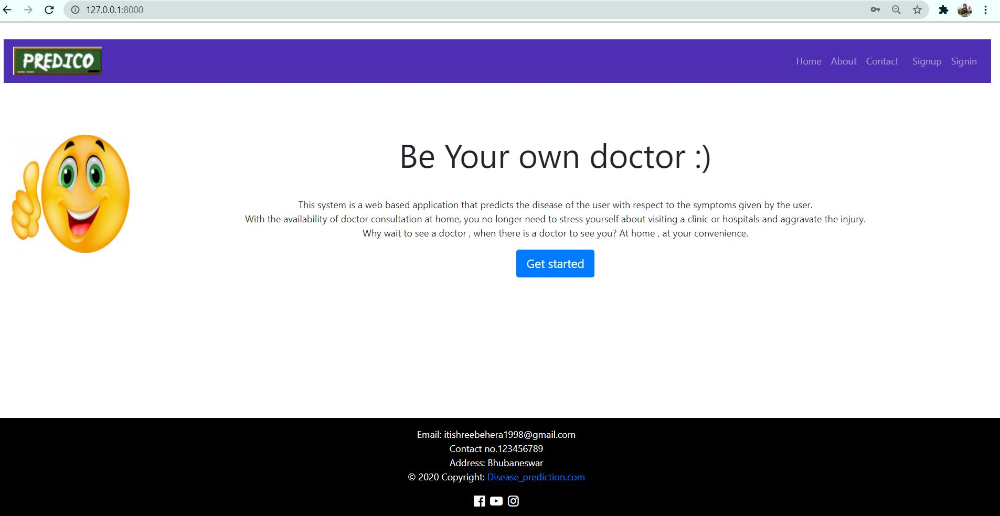

# Django_Disease_Prediction_System

In the proposed system the diseases are predicted automatically by the system using our model which is trained on the medical dataset. This system also shows the 
confidence score of the prediction. After getting the anticipated disease, the system 
will suggest doctors associated with that disease and therefore the patient can consult 
to the doctor online. The proposed system acts as a decision support system and will 
prove to be an aid for the physicians with the diagnosis.

## Technology & tools: 
  ### Frontend : 
      HTML, CSS, Javascript, BOOTSTRAP 4.0
  
  ### Backend : 
      Django 
  
  ### Technology :
      Machine learning
  ### Database:
      PostgreSQL

